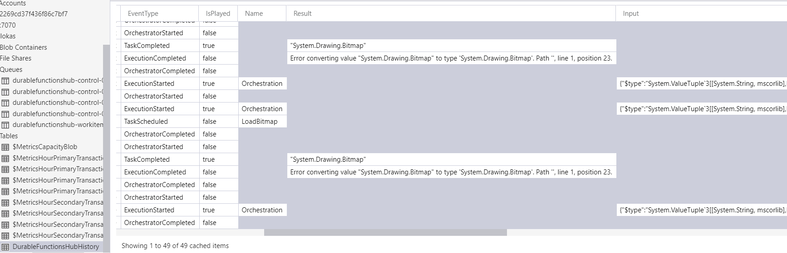

It worth to make a service and host it somewhere in a cloud. (Next slide)


How to orchestrate all these functions in a way that all the parts play nicely together in a synchronized and consistent way.

Output from one function needs to be sent as an input of another function, or some of them needs to be executed in a loop.

The answer is that we can use (Next slide)


## Durable Functions
- Simplify orchestration 
- Code your workflow  
  - Save output to local variables
- Stateful functions  
  - State is never lost


Durable Functions! (Next bullet)

The main use case for Durable Functions is simplifying complex orchestration problems in serverless applications. (Next bullet)

Workflow is now can be defined in code. No JSON schemas or designers. (Next bullet)

They are statefull. The progress is not lost when VM is restarting. It is one of the key features of Durable functions that they are 100% reliable.

There are some patterns where Durable Functions fit well.


### Function chaining


call one function after another passing results into the next one


### Fan-out/fan-in


We can call functions in parallel, gather result and do something else.

There are 3 more patterns on official documentation.

Let's jump into coding trying to apply it to the problem and see how does it work in practice


## Demo coding


The Azure Durable Function library adds two function bindings that are used by the system to find which functions should be treated as Durable:

- OrchestrationTrigger – All orchestrator functions must use this trigger type. This input binding is connected to the
  - DurableOrchestrationContext class that is used by the orchestrator to call durable-activities and create durable control flow
- ActivityTrigger – marks a function as activity, which allows it to be called by an orchestrator function. 
This input binding is connected to the DurableActivityContext class which allows the activity function to get the input and set the output.


# Easy!


That was pritty easy!

This was an example almost identical to one that Microsoft provides - so it should work

but usually your case is a bit different and when you go a bit different direction you experiance some issues. 


## Demo coding 2


### What?!


Don't know how about you, but I've got a lot of questions.


### What?!

 

- Storage account
- Serialization 
- Not supported async calls 

- Why does it requires storage account for orchestrator and activity functions? (next bullet)
- Serialization is the simplest one - we can assume that it transfer object between functions that way (next bullet)
- Why it complains about async calls that done without using context? (next bullet)
- It used to have another issue - it didn't allow payload more than is 60K?
- We need to learn how durable functions work under the hood. What makes them durable?


Now we can answer some of our questions


 

- Storage account
- Serialization 
- Not supported async calls 

As we saw Azure Durable Functions will create Queues under our storage account, that is why it is required(next bullet)

It is indeed serializes/deserializes objects to send them between functions

The last one is still not that clear. But we saw that function should somehow restore it's execution. 
Let's run our code again(next slide)


### Demo coding 3

and check the execution flow, how it gets reconstructed after calling an activity?


### Execution flow
- Checkpoint/Replay 

The thing is that orchestrator functions use one of the Event Sourcing technique - Chckpoint/Replay

That ensures reliable execution of orchestrations by checkpointing execution history into a storage table.

You can find all the checkpoints in your storage account (next slide)


#### History table



in the DurableFunctionHubHistory table

That history is replayed to rebuild the state of orchestrator function.

This is one of the key attributes of Durable Functions - reliable execution. Orchestrator and Activities may be run on different VMs in some environment that is not 100% reliable.

This repay process leads to an interesting execution behaviour. Let me show it on an example(next excample)


 

with the help of this guys. Let them practice in origami and ask them to make a plane 

one of the them will be orchestrator and another one activity


 

Like this


 

The reaction is strange.


This instructions are executed by the orchestrator and all the folding operations are done by the activity.


```CSharp
for (var stepIndex = 0; stepIndex< 6; stepIndex++)
{
  await ctx.CallActivityAsync("Fold", input);
}
```

How many ctx.CallActivityAsync() calls? 

be respresented in code like this (next bullet)

How many times the call activity async method will be called?

This is a triangular number that(next slide)


(N \* (N-1)) / 2 = 6 \* 5 / 2 = 15

TODO: put propper formula

can be calculated as follows.


### Calls to Activity


- 7 - 21
- 10 - 45
- 20 - 190
- 100 - 4950

that means that if we have a loop with 20 iterations -  190

It becomes really noticable when 

```CSharp
for (var stepIndex = 0; stepIndex< 6; stepIndex++)
{
  DoSomethingHeavy();
  await ctx.CallActivityAsync("Fold", input);
}
```


We have some code in the Orchestrator that is kind of heavy. This code will be executed 15 times while Fold only 6.

That leads us to another topic - optimizations


### Possible optimizations
- Avoid heavy code in Orchestrator 
- Use sub Orchestrations  
- Minimize reads from storage  


### Restrictions

- Avoid non-determenstic 
- Avoid async calls 
- Avoid infinite loops 

It will be replayed multiple times and must produce the same result each time. For example, no direct calls to get the current date/time, get random numbers, generate random GUIDs, or call into remote endpoints. (next bullet)

The Durable Task Framework executes orchestrator code on a single thread and cannot interact with any other threads that could be scheduled by other async APIs. (next bullet)

saves execution history as the orchestration function progresses, an infinite loop could cause an orchestrator instance to run out of memory.

But still problems can happen and you might be stuck (next slide)


### Support
- GitHub
- StackOverflow
- Twitter

then Post the issue on stack overflow also tweet about it, put hash tag Azure, Azure Functions and usually you get help quite fast


## Key take aways
- Statefull orchestration 
- 100% reliable 
- Orchestrator restrictions 
- Checkpoint/Replay 
- Sub Orchestrators 
- Prerelease 
- Heavy computations? 

- What are the key take aways? (next bullet)
- Durable extension allows to orchestrate azure functions (next bullet)
- It is 100% reliable. You need to remember (next bullet)
- about the restrictions, that the orchestrator code should be detemenistic, you cannot use async calls other than via durable context (next bullet)
- Keep in mind the Checkpoint/Replay technique that is used by Orchestrator and use (next bullet)
- sub orchestors in order to improve performance
- It is still pre release, many things can go wrong, many things can change. Don't hesitate to ask for advice on SO etc.
- If you want to port some performance critical computations think twice as you'll spend a lot of time to serialization and desirialization


# Questions

- Pricing
  - GB-s $0.000016
  - Cost of one mln exec $0.20
  - Cost of one minute => 0.128GB * 60000ms = 7680 Gs
  - Free GB-s per month => 400,000 free ~ 52 min 
  - Free executions => 1,000,000 