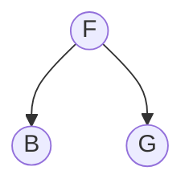
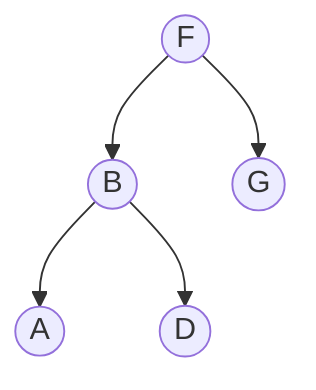
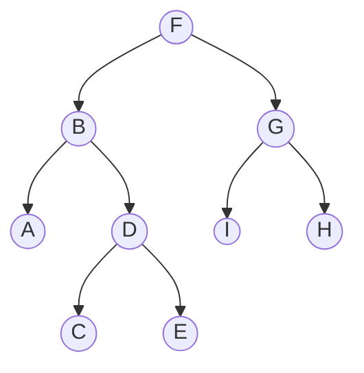

It is always interesting to measure your skills in problem solving. One of the ways to check how good you are, is to participate in Facebook Hackercup. If you consider participating next year - I'd like to share my top 5 learnings from this year.

### 1. Train yourself to understand challenge quickly 
Challenges' descriptions are huge. You have to be very attentive to get it right. After the problem is understood, it needs to be translated into a technical problem. You can train this skill using the [challanges from previous years](https://www.facebook.com/hackercup/past_rounds/1825579961046099/).

### 2. Solve without coding first
Every challenge has a sample input and output. Use this information. Although it is tempting to start coding right away, try to solve it step by step on paper or on a white board. Make sure that you have the same output. 

This approach will help you to see patterns or even to find a simple solution. For example here is one of the challenges:

>Consider an N-degree polynomial, expressed as follows:
>
>$$P_N * x^N + P_N-1 * x^N-1 + ... + P_1 * x^1 + P_0 * x^0$$
>
>You'd like to find all of the polynomial's $x$ ( 
>all distinct real values of $x$ for which the expression evaluates to $0$).
>
>The order of operations has been reversed: Addition ($+$) now has 
>the highest precedence, followed by multiplication ($*$), followed by exponentiation (^). 
>
>Constraints: $P_N ≠ 0$

After reading this you might think that this problem is somehow similar to [3-sum problem](https://en.wikipedia.org/wiki/3SUM). However if you put it down on paper or whiteboard it will be obvious that the solution is quite simple:
- The polynomial can be evaluated to $0$ when $x = 0$ and polynomial's degree is odd.
- Otherwise it cannot be evaluated to $0$.

The code in the end will be simple:

```python
def calculatePolynomialInterceptions(degree)
    if degree % 2 !=0:
        return [0.0] # the only possible solution
    else:
        return [] # no such x
```

<details><summary>Explanation</summary>
<p>

It might take some time to realise how a polynomial would look like after applying new operations order. Let's start with $N=3$ and write the polynomial down:


$P_3 * x$ ^ $3 + P_2 * x$ ^ $2 + P_1 * x$ ^ $1 + P_0 * x$ ^ 0

According to the order of operations it should look as following:

$(P_3 * x)$ ^ $((3 + P_2) * x)$ ^ $((2 + P_1) * x)$ ^ $((1 + P_0) * x)$ ^ $0$

From that we can see that we have $(P_3 * x)$ as a base and the rest as an exponent. We will refer to the exponent as $a$:

$a = ((3 + P_2) * x)$ ^ $((2 + P_1) * x)$ ^ $((1 + P_0) * x)$ ^ $0$

and will get the expression:

$$P_3 * x ^ a = 0$$ 

Since $P_3 ≠ 0$ according to the problem description, the polynomial can be evaluated to $0$ only and only when $x = 0$ and $a ≠ 0$. 

We have found the $x$ and the only thing we need to do is to make sure that $a ≠ 0$, otherwise $P_3 * 0^0 = P_3$. 

Let's take a look at $a$. Since $x = 0$, we will get:

$a = ((3 + P_2) * 0)$ ^ $((2 + P_1) * 0)$ ^ $((1 + P_0) * 0)$ ^ $0$

$a = 0$ ^ $0$ ^ $0$ ^ $0$

$a = 1$

The answer is that the *3rd-degree* polynomial does evaluate to $0$ only and only when $x = 0$. However if it would be *2nd-degree* polynomial, it does not evaluate to $0$ for any real value $x$:

$a = 0$ ^ $0$ ^ $0$

$a = 0$

$P_2 * x^0 = P_2 * 1 = P_2 (≠ 0)$

It turns out that the final solution of this problem is quite easy - we just need to check whether the polynomial degree is odd, and if it is so then it can be evaluated to $0$ when $x = 0$.

</p>
</details>

### 3. Use brute force and improve
Use a naive approach and solve a problem as quick as possible. Once you have a solution ask yourself following questions and try to improve these aspects if an answer is positive:
- Are there bottlenecks?
- Are there duplicated work? 
- Are there useless work?

### 4. Solve and reverse engineer your thought process
Forget about your CS skills and try to solve a problem as a human or as a small kid. Got a solution? Reverse engineer your thought process and convert it into an algorithm.

<details><summary>Example</summary>
<p>

For example you are challenged:
> Given [Pre-order](https://en.wikipedia.org/wiki/Tree_traversal#Pre-order_(NLR)) and [In-order](https://en.wikipedia.org/wiki/Tree_traversal#In-order_(LNR)) traversals of a tree, reconstruct the tree.
>
> In-order: A, B, C, D, E, F, I, G, H
>
> Pre-order: F, B, A, D, C, E, G, I, H

What you can try is to reconstruct the tree without thinking about algorithms, loops, recursions, stacks whatsoever.

What we know is that in pre-order the left element is the root. Let's draw the root:


Next root element is `B` but where to put it - we don't know yet. Looking at the in-order traversal result, we can notice that `F` splits it into two: `A, B, C, D, E` and `I, G, H`.

These are nodes that are on the left and on the right from our root `F`. Which nodes are children of `F`? The ones that come first in the pre-order - `B` and `G`:



Now `B` splits the in-order `A, B, C, D, E` into the only left child `A` and descendant ondes on the right `C, D, E`. Which node is the right child of `B`? The answer is `D`, since it comes first in the pre-order.


After repeating this process you will reconstruct the whole tree:



What you can do now is to wrap this process into an algorithm: 

```python
def reconstructTree(in_order, pre_order):
    # if pre_order is empty - return None
    # extract first from pre_order as root
    # split in_order based on the root into:
    #    in_order_left
    #    in_order_right
    # split pre_order based on in_order_right &in_order_left into:
    #    pre_order_left
    #    pre_order_right
    # attach reconstructTree(in_order_left, pre_order_left) to root as left child
    # attach reconstructTree(in_order_right, pre_order_right) to root as right child

```

</p>
</details>

### 5. Be careful about details
Once the code is written, check it twice. Pay attention to boundary cases. 
- 0-indexed vs 1-indexed? 
- Double check the code where you add or substruct 1(if you do). Make sure that these boundaries are correct.
- Do you compare values anywhere? Check them - should a value be *greater* or *greater or equal*?
- Do you handle incorrect input?

These were my learnings from this year Hackercup. If you ask me how far did I go, I tell you that I almost did it to round 3(not bad for the first try). Solve challenges and have fun! Good luck!