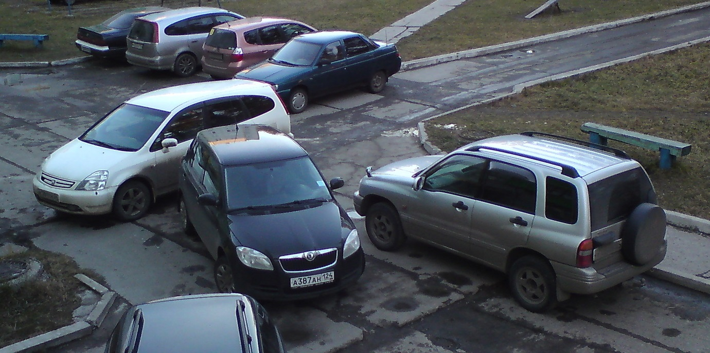

It’s been a week since our regular hackathon at Parkmobile and it's a good time to recap and share key takeaways. The aim of the hackathon was to find innovative solutions that improve the life of drivers dealing with the parking challenges. I teamed up with a few like-minded people and we focused on Parking Availability challenge. Here I am going to deep-dive into the availability problem and share our findings.

### The challenge

> As a customer I want to search for parking in a specific area and get insight if there are spaces available? So show our customers parking prediction per street/area using our transaction history.

### Naive approach

The first reaction was, not surprisingly ... Machine Learning. And here we go: people started to argue whether it should be TensorFlow or AWS SageMaker, should we use the data from Amsterdam or from Paris, how accurate must be the prediction and so on and so forth. People that know absolutely nothing about the data science or machine learning, those suddenly turned into cool experts and with the very smart face tried to show off their intelligence. Tell you what, the Machine Learning is as useless here as a blockchain. Never start from technology!

### Right approach

We returned back to the drawing board. This time we focus on the most important thing: **what** we are trying to solve, rather than **how**. And immediately an excellent question popped up: are we reinventing the wheel, i.e. is there already existing solution on a market? The research shows three main approaches to the availability problem:

- Heatmap with colors indicating the occupancy on the street level. For example Parkmobile US:

- Indication of how busy is the area, like Google Maps:

- Exact number showing the available parking spots, like ParkMe:

We quickly figured out that these existing approaches are not solving the **availabilty** problem as we see it. They rather give you an insight on what's going on. But the problem is:

> Whether or not I can park, taking into account my personal situation

It's different whether you drive luxurious 5 meter long BMW 5 Series vs Mini One. It does matter whether you are experienced driver or a rookie. Do you have small children with you? Then, perhaps, you do not want to park nearby in 15 minutes walking distance. Are you a student? Then, most likely you do not mind to park cheaper (outside of the city center) and walk 15-20 minutes. Are you by any chance driving an electric vehicle and need to charge it? Or you might be using the car sharing services and you are limited in options where you can leave the car.

None of the existing solutions take your personal situation into account. And none of them answers whether or not you can park. All you see is the number or load distribution which is not enough to decide if you can park or not. We did a mini-survey to better understand the process of how people chose where to park. Most of us use the Google Maps to check street view and get an idea of how busy is the area. Some people go further and check the traffic and adjacent streets. Finally people evaluate the alternate transport, for example getting by car to the nearest P+R and then use the public transportation. And this is what we want to change and simplify for the user. Now, that the **what** is clear we focused on analyzing the edge cases that would affect the accuraccy of our solution.  

### Edge cases

 What if the parking lot seems to be vacant, but it is too narrow to park there? For example someone parked the car inappropriately.

What if the parking lot is technically free, but far away from desired location? Or it's raining and you need to walk through mud.
What if the parking lot is technically free, but far away from desired location? Or it's raining and you need to walk through mud.

How many free parking spots you can see here?

What if someone parked illegally and this prevents you from accessing the only available parking space?

There might be a false positive situation where the street is very busy in terms of traffic and it's always occupied at 100%, but people constanly come and leave, hence waiting just 5 minutes will definitely give you a chance to park there. And the opposite: the street is half occupied, but once people park there they leave the car for the whole working day. Hence if you came there at 08:50 AM and there were 10 parking spots available, then at 09:00AM all of them will be taken and they will be free starting from 05:00PM and later.

Consider scenario when there are a few parking spots available and you do not know if you should take the first one or drive further hoping that there is better spot closer to your target. It will be very frustrating if remaining parking spots are at the end of the street, whereas you skipped the one at the beginning of the street, right? It would be great if our tool is able to figure out all this and recommend you the best parking spot.

Very soon we admitted that proper solution must take the user's preferences into account. We need to know the original intention of the user in order to say 'Hey, go and park here, this is the best parking spot for you'. The intention is a key here. The user wanted to park somewhere else, but for whatever reason our user could not park there. Why? If people can not park there, should we still send others there?

Now, if we start collecting the users feedback, we will greatly improve the accurracy and solve the issues caused by the edge cases. Is there a free spot next to you? This would confirm that our prediction is correct, otherwise we adjust it. Was it easy to find parking lot here? If we predicted "easy to moderate" and the user says "hard" - we need to adjust our model. Was it convenient to park here or you would rather park somewhere else? Having the preferences and feedback we can recommend 'best matches' and the user does not need to waste time checking how many parking spots are available and then checking Google Maps to see the occupancy of an area and/or how to get to the desired location from parking place.