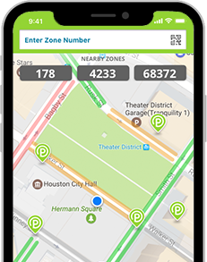
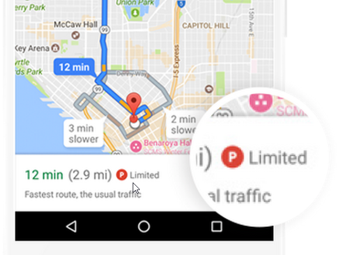
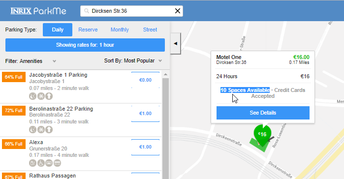
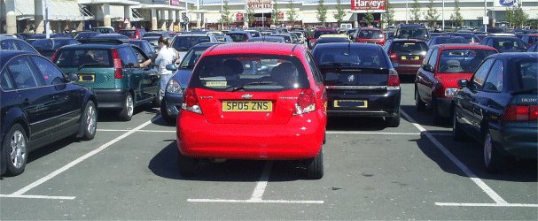
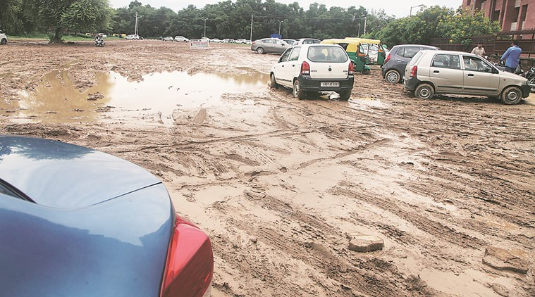
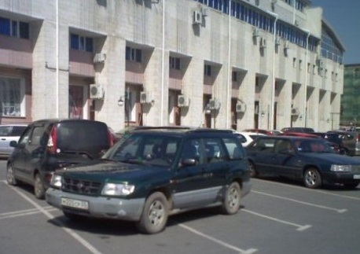
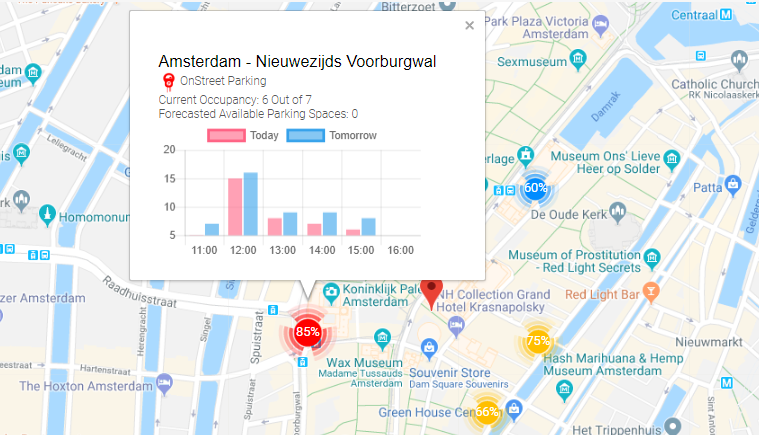

It’s been a week since our regular hackathon at Parkmobile and it's a good time to recap and share key takeaways. The aim of the hackathon was to find innovative solutions that improve the life of drivers dealing with the parking challenges. I teamed up with a few like-minded people and we focused on Parking Availability challenge. Here I am going to deep-dive into the availability problem and share our findings.

### The challenge

> As a customer I want to search for parking in a specific area and get insight if there are spaces available? So show our customers parking prediction per street/area using our transaction history.

### Naive approach

The first reaction was, not surprisingly ... Machine Learning. And here we go: people started to argue whether it should be TensorFlow or AWS SageMaker, should we use the data from Amsterdam or from Paris, how accurate must be the prediction and so on and so forth. People that do not have hands-on experience with the data science or machine learning, those suddenly turned into experts and started to show off their intelligence :) Tell you what, the Machine Learning is as useless here as blockchain. Never start from the technology! 

Explanation

At the minimum you are coupled to this exact technology and limited due to all the constrains that come with the chosen technology. Moreover, there is no unique selling point when you rely on technology. Your competitors will do the same, i.e. adopt the same technology and you all end up with the same results. Take cryptocurrency for example, they all based on blockchain and there is more than 1600 of them, whereas only 5-10 of them are really worth to invest.

### Right approach

We returned to the drawing board. This time we focus on the most important thing: **what** we are trying to solve, rather than **how**. And immediately an excellent question popped up: are we reinventing the wheel, i.e. is there an existing solution on a market? The research resulted in the following three  approaches for addressing the parking availability:

- Heatmap with colors indicating the occupancy on the street level, e.g. Parkmobile US:

- Indication of how busy is the area, e.g. Google Maps:

- Exact number showing the available parking spots, e.g. ParkMe:

We quickly figured out that these existing approaches are not solving the **availability** problem as we expected. They rather give you an insight on what's going on in realtime and show you the occupancy of certain street. We do not want to know the exact number nor the color of the street. Finally, we worked out the **what** :

> Whether or not the users can park in target area. If not, where can they park?

### User stories

The first step is to understand your target users and customers. We used Personas and tried to imagine the most important types of user.

* Clearly, parking is different when you drive luxurious 5 meter long BMW 5 Series vs Smart Fortwo. The chances to park your Smart are much higher, you will fit into impossibly small gaps.

* It does matter whether you are experienced driver or a rookie. A rookie will avoid the parallel parking in narrow area. An experienced driver does not mind parallel park by touch (aka Paris style)

* Contrary what if you are a rookie, but driving BMW i3 that has brilliant self-parking feature (Intelligent Parking Assist System)? You do not care about parking complexity anymore

* How about parents with the baby? Probably you are not very excited to park and walk 15 minutes with the stroller

* However, the student does not mind to park in cheaper place and the walk 15 minutes to the target destination

* Finally, are you by any chance driving an electric vehicle that needs to be charged? Or are you using the car sharing services, so you are limited in where you can leave the car?

### Edge cases

There are many things that will affect the accuracy of the results, here are the most annoying:

* The parking lot seems to be vacant, but it is too narrow to park there. E.g. someone parked the car inappropriately:

* The parking is on grass or field (usually concerts, P+R), so if there is a heavy rain you will need to walk through mud:

* How can you detect the following illegal parking? You can not trust the real-time occupancy, which reports 4 vacant parking spots

### Deep Analysis

We know what we want to solve, we identified the target audience and highlighted the edge cases. Having analyzed all the data we tried to imagine the user interface. We had to take into account a few more very important things that affected technical solution:

* There is a very busy street that is always occupied at 100%, but it is very dynamic and cars constanly come and leave. Parking time is 5-15 minutes. Hence, the parking is relatively easy and available. This brings us to important metric **parking duration** and **waiting time**

* Opposite situation. At the given moment the street is half busy. However, parking duration is long, e.g. whole working day. Hence, if you came there at 08:50 AM and there were 10 parking spots available, at 09:00AM all of them will be taken and they will be free starting from 05:00PM. The parking is very difficult there and depends on **time of the day**

* Consider scenario when there are a few parking spots available and you do not know if you should take the first one or drive further hoping that there is better spot closer to your target. It will be very frustrating if remaining parking spots are at the end of the street, whereas you skipped the one at the beginning of the street, right? It would be great if our tool is able to figure out this and **recommend you the best parking spot**.

### User data

Very soon we understood that proper solution must take the user's preferences into account. We need to know the original intention of the user in order to say 'Hey, go and park here, this is the best parking spot that suits you'. The intention is a key here. The user wanted to park somewhere else, but could not. We think it is important information. If people can not park there, we should adjust the recommendation and do not send others there.

Now, if we start collecting the users' feedback, we will greatly improve the accuracy and solve the issues caused by the edge cases. Is there a free spot next to you? This would confirm that our prediction is correct, otherwise we adjust it. Was it easy to find parking lot here? If we predicted "easy to moderate" and the user says "hard" - we need to adjust our model. Was it convenient to park here or you would rather park somewhere else? Having the preferences and feedback we can recommend 'best matches' and the user does not need to waste time checking how many parking spots are available and then checking Google Maps to see the occupancy of an area and/or how to get to the desired location from parking place.

### Solution

The solution consists of the two parts. First part is for the users who is going to park and want to see the situation before they drive there. The second part is targeting the users who can provide feedback upon arriving at parking place or leaving it.  We will discuss the solution in depth in the next blog post. Below is the screenshot from the working app at the end of hackathon:

### Summary

None of the existing solutions take users personal situation and preferences into account. Moreover, none of them gives the answer whether or not the user can park. All the user gets is the number or load distribution which is not enough to decide if the user is able to park or not. We did a mini-survey to understand the process of how people chose where to park. Most of us use the Google Maps to check street view and get an idea of how busy is the area. Some people go further and check the traffic and adjacent streets. Finally, people evaluate the alternate transport, e.g. getting by car to the nearest P+R and then use the public transportation. And this is what we want to change and simplify for the user.  
