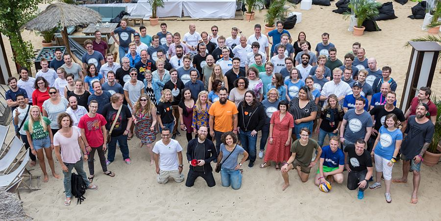

## Intro

How about having a hackathon in the train? Sounds crazy insane, but really cool, isn't it? Consider high-speed train heading to Berlin with 100+ participants spread over two train wagons. Here at Parkmobile, we like cool things with the spirit of innovation, needless to say I am in!

## Hackathon overview

There are 14 teams with 6 participants in each team. There are some people outside of the teams: coaches, mentors and supporting staff. A team contains a few software developers (usually 2-3), scientists and 1-2 students (comletely non-IT folks). For example, there were two students of Theatre and Performance Studies in my team. The hackathon begins in the train ... in offline mode (yep, no internet!) and then continues in the venue in Berlin. Time is very limited and you start conding only in the evening of Day 1 (certainly after dinner and 1-2 beers) while pitches start at 2:00 PM on the Day 2. The winning team gets 5, 000 euro gross.

## Lessons learned

I really hate scrolling down all the way to the bottom of the page to see the most important section. Hence I break the tradition and put the most important stuff right here.

There were a few key points I took away from this event. There are lots of them, but here I listed crucial only:  

* Parkmobile is a great company! Ahaha, now seriously. Having talked to the fellow participants (huh, competitors!) from other companies I clearly see that Parkmobile invests much more into innovation and technical development of our people. Perhaps because we are a part of mature BMM Group. Or, let's be honest, that's why we are a part of BMW Group.

* Acceptance criteria. Ask how jury is going to chose the winner. We were all surprised with the jury's obscure choice. Even the winners...
* Communication. People like and do talk a lot. Absolutely not listening nor analyzing what others just said. And they try to make a point and they try to prove their point. And you have to be brave and delicated to stop useless discussions but keep the team's focus on solving the challenge and efficiently distribute the work between developers.
* Time management. Oh how many developers I've seen in panic mode on the Day 2, especially closer to the pitch time. No comments. The hackathon is a great real-world excercise of how to manage your time efficiently, go and try.
* Teamwork. Don't even think of sitting alone and **doing your part**. You will end up with well known result: your part works well while whole solution does not work.
* Energy and drive. Every team needs someone energetic and proactive. The team is loosing willingness to win as soon as they encounter issues. Push them forward, do not let your motivation go down.

## Challenge

> You are going to the concert that ends at the late night. Develop the solution by utilizing Mobility-As-A-Service and Blockchain to help the users to return home according to their preferences.

The way it was formulated... well, you know, it could have been much better.

## Day 1

Train is full. Berlin, here we come!

That was quite warm weather and it was incredibly hot inside the train. We had to change our sweaty T-shirts every now and then. My team gathered together and we started brainstorming. At that moment, the main challenge was to stay together and follow the discussion as there were people passing nearby and a lot of noise from other participants.

## Day 2
