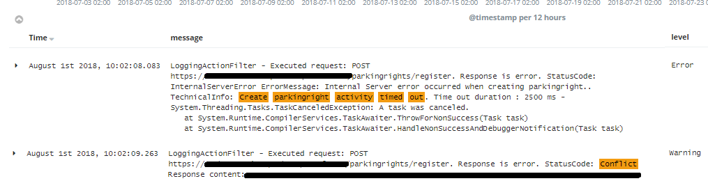
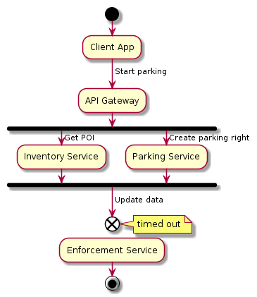

 The timeout pattern is perhaps the most basic way to reveal performance issues and satisfy the SLA. Even though the request did not succeed, the client gets the response within defined SLA time span and the request can be retried later. It sounds really easy: just set the timeout in a service client (RestSharp.RestClient, HttpWebRequest etc), so that the request is aborted once timeout exceeded. But is it so?

This is a real-world production microservice that has all the timeouts configured, check this out:

You can see that the attempt to create a new item has timed out and the client received an error response with 500 http status code. The client retried immediately and received the error response with 409 http status code, saying that the item already exists. This is what happened:

The process in-depth is illustrated below:

