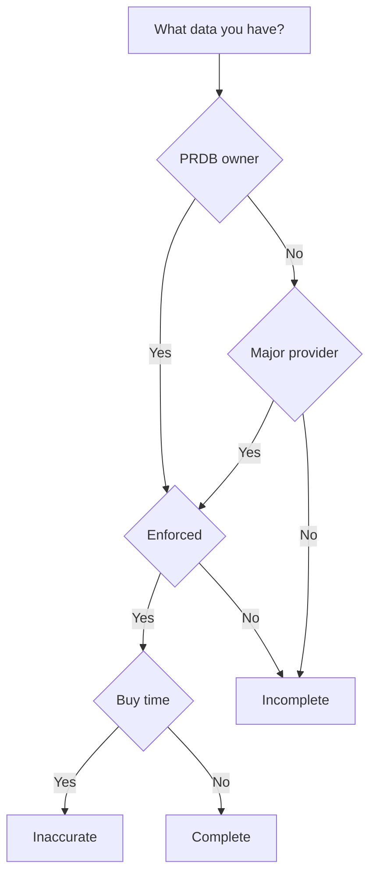

Do you have a lot of data that you were collecting many years and now you consider doing some magic by applying Machine Learning? It might be dissapointing to get to know that the data you were collecting is not complete. 

In this post I'll summarize our experience of trying to apply Machine Learning during our company's internal hackathon([here are more info about the hackathon]()). 

## Problem
We tried to use Machine Learning to takle **parking availability** problem that was stated as follows:

> As a customer I want to search for parking in a specific area and get insight if there are spaces available? So show our customers parking prediction per street/area using our transaction history.

To be honest - Machine Learning was the first solution that poped up in our technology driven minds. 

## Machine Learning
What do we know about Machine Learning?
> Machine learning is like teenage sex: everyone talks about it, nobody really knows how to do it, everyone thinks everyone else is doing it, so everyone claims they are doing it.. 
>
> (c) Someone smart and funny

What we want essentually is that our program learns how to solve a problem **itself**. We could write a piece of software that has a lots of `if` statements for all kind of situations, but we are lazy and it's also doesn't look feasible.

There are following types of learning methods available to solve different types of problems:
- Supervised learning for predictions and classifications
- Unsupervised learning for clustering and associations
- Reinforcement learning (learn smth)

As we can see above, to be able to make predictions about parking availability we need to utilize supervised learning. 

## Supervised learning
How does the supervised learning works? In supervise learning we teach our model to make predictions in a loop:
- ask model to make a prediction based on an input data
- compare the prediction with desired output
- method adjusts model based on the error 
- repeat from the first point

The key point is that **we must know the output for each input** in the training data set. This paired data of *inputs and outputs* is named **labeled** data.

The classical example of labeled data for supervised learning is a data set of labeled images with dogs and cats. We know who is pictured on each image: a cat or a dog.

The knowledge of the output allows us to train the model in supervised manner. 

## Prediction of Parking Availability with Supervised Learning
Now let's try to answer the question - **how our data set should look like so that we could predict parking availability?**

**The output data** should be either *parking is available* or *unavailable*. It can have a different forms ofcourse - binary(yes, no), probability of availability(87% is available).

**The input data** preferebly should have some subset of features that influence parking availability directly or indirectly. This is quite chellanging problem to select the features wisely so that our model will make quite accurate predictions but at the same time doesn't get overfitted.**(TODO: explain)**

## ML chellanges
- Not enough data when you are not PRDB owner
- Number of free parking spots doesn't matter (every 15 min in fully occupied zone someone is leaving).

The situation might be a bit different if you are an owner of PRDB. Enforcement does a good job, so that people usually don't park without paying for it. You don't occupy a parking spot when you don't need it.

> PRDB states for Parking Rights Data Base

