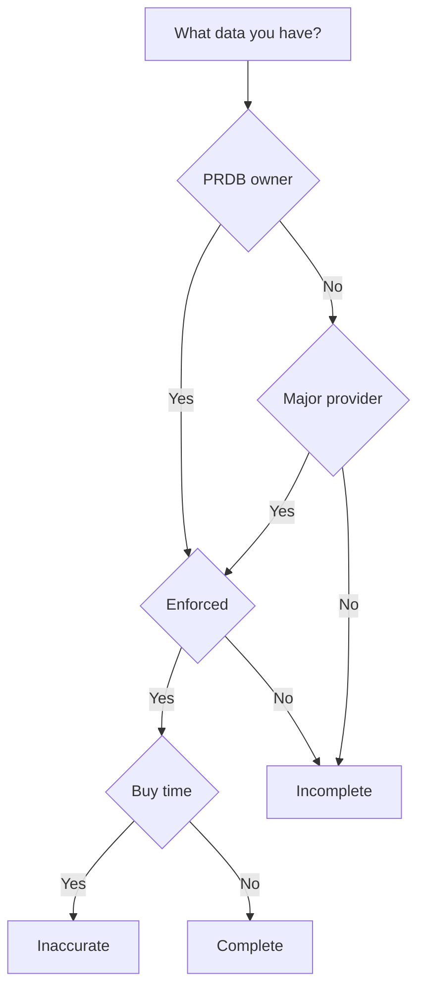

Do you have a lot of data that you were collecting many years and now you consider doing some magic by applying Machine Learning? It might be dissapointing to get to know that the data you were collecting is not complete. 

In this post I'll summarize our experience of trying to apply Machine Learning during our company's internal hackathon([here are more info about the hackathon]()). 

### Problem

During the hackathon we takled a **parking availability** problem that was stated as follows:

> As a customer I want to search for parking in a specific area and get insight if there are spaces available? Show our customers parking prediction per street/area using our transaction history.

The brute force approach would be to hardcode the availability for all possible parameters' values that affect the availability in particular parking location. Suppose that as parameters we have only `month`, `date`, `week day` and `time`, then the lookup table for one of the parking locations will look like:

|Month|Date|Week day|Time|Availability|
|-----|----|--------|----|------------|
|January| 1 | Monday| 00:00| Available|
|January| 1 | Monday| 00:05| Available|
|January| 1 | Monday| 00:10| Available|
|January| 1 | Monday| 00:15| Available|
|...| ... | ...| ...| ... |
|January| 1 | Tuesday| 00:25| Unavailable|
|January| 1 | Tuesday| 00:30| Unavailable|
|January| 1 | Tuesday| 00:35| Available|
|...| ... | ...| ...| ... |
|December| 31 | Sunday| 23:55| Available|

Having such a lookup table we could tell to someone who wants to park in this location on Tuesday January 1st at 0:27 that there are no available parking spots.

Unfortunately we don't know **what** and **how** influences the availability. That is why creating such a lookup table is not feasible. 

To be honest, we didn't even consider that because the first solution that poped up in our technology driven minds was Machine Learning. 

### Machine Learning
What do we know about Machine Learning?
> Machine learning is like teenage sex: everyone talks about it, nobody really knows how to do it, everyone thinks everyone else is doing it, so everyone claims they are doing it.. 
>
> (c) Someone smart and funny

What we want essentually is that our program learns how to solve a problem **itself** by discovering hidden patterns in the training data set.

There are following types of learning methods available to solve different types of problems:
- Supervised learning for predictions and classifications
- Unsupervised learning for clustering and associations
- Reinforcement learning for learning from experiments

As we can see above, to be able to make predictions about parking availability we need to utilize supervised learning. 

### Supervised learning
How does the supervised learning works? In supervise learning we perform followind steps to train our model:
- initialize a model with random parameters
- ask model to make predictions based on an input data
- evaluate the prediction based on **known output**
- adjusts model's parameters to minimize the error 

The key point is that **we must know the prediction(output) for each input** in the training data set. This paired data of *inputs and results* is named **labeled** data.

The classical example of labeled data for supervised learning is a data set of labeled images with dogs and cats. We know who is pictured on each image: a cat or a dog.

The knowledge of the output allows us to train the model in supervised manner. 

### Parking Availability Training Data Set

Now let's try to answer the question - **how our training data set should look like so that we could predict parking availability?**

**The output data** should be either *parking is available* or *unavailable*. It can have different forms ofcourse - binary(yes, no), or probability of availability(87% is available), or something else.

**The input data** should have features that influence parking availability. Features selection is a quite chellanging problem itself. We need to select them wisely so that our model will make quite accurate predictions for inputs that it haven't seen before.

Desired data set could look like this:

|input   curLat, curLon, destLat, destLon, day, minute |label (output)   availability|
|-----|------|
|`52.3485772, 5.0082082, 52.356612, 4.895434, 244, 772`|true|
|`52.3485241, 5.0082011, 52.356278, 4.995423, 345, 631`|true|
|`52.3485789, 5.0082022, 52.353972, 4.995412, 134, 1083`|false|
|`52.3489271, 5.0082082, 52.356129, 4.993729, 245, 890`|false|
|`52.3485772, 5.0082090, 52.356605, 4.995392, 64, 402`|true|

Important part of the data set is the **labels** because we must know whether a parking was available in the given situation. Do we have these labels in our data that we have been collecting for years?

###  Cashless Parking Providers and data

What data do we have in reality? As the problem states - we need to give a prediction based on **transaction history**. These transaction history comes from a cashless parking provider(CPP) and basically are payments for parking in a particular zone at particular time.

Clients of CPP use the provided services once they are parked and want to pay for the parking. Therefore CPP receives transactions only for successful parkings - *client managed to park in a particular area*. 

Moreover the **successful parkings** might be *false positives* since we don't know where the client wanted to park **initially**. It is possible that the client wanted to park in one place but it was completely full so he ended up parking in another place far away from the initial destination point.

The conclusion is that the **transactions cannot be used as labeled training data set** to train a model to predict parking availability.

### Availability = Amount of Free Spots?

Can we derive availability from the amount of free parking spots? Why not? Whenever we can say that there will be `X` parking spots free, we can say that parking in the area is available.

In order to train our model to predict amount of free parking spots, our desired labeled training data set should look like:

|input   curLat, curLon, destLat, destLon, day, minute |label (output)   amount of free parking spots|
|-----|------|
|`52.3485772, 5.0082082, 52.356612, 4.895434, 244, 772`|23|
|`52.3485241, 5.0082011, 52.356278, 4.995423, 345, 631`|68|
|`52.3485789, 5.0082022, 52.353972, 4.995412, 134, 1083`|0|
|`52.3489271, 5.0082082, 52.356129, 4.993729, 245, 890`|0|
|`52.3485772, 5.0082090, 52.356605, 4.995392, 64, 402`|45|

In order to label the data we should know amount of free parking spots. The math here is pretty simple:
1. Estimate a $$Capacity$$ of the parking area. As the capacity we can consider a historical maximum amount of simultanious parking transactions at the area.
2. Amount of $$Occupied$$ spots is amount of simultanious transactions for a given time and location. 
3. $$Free = Capacity - Occupied$$

### Accuracy of Free spots prediction

The accuracy of such model will depend on several factors and will vary per city.

**Do we have all transactions in a City?** If we don't we cannot estimate a capacity of a parking location and how many spots are occupied. 

**Does enforcement works good?** In worse case (when there is no enforcement)drivers won't pay for parking. This will lead to situation where we see that there are 5 free parking spots, however they are occupied without paying.

**Transactions reflect exect parking duration?** There are cases when driver buys 20 minutes to park but leaves after 10 minutes. In couple minutes this spot gets occupied by another car that also creates a transaction. That can influence our estimations of parking space capacity by making it bigger.

**Are there special tariffs?** In a case when resedents don't pay for the parking they will occupy a spot but it will not create a transaction. In residential area we will see many free spots that are occupied by resedents in reality.

>//TODO: our experement and unreliable result

>//TODO: main conclusion - we have to collect data

### Data

> PRDB states for Parking Rights Data Base

