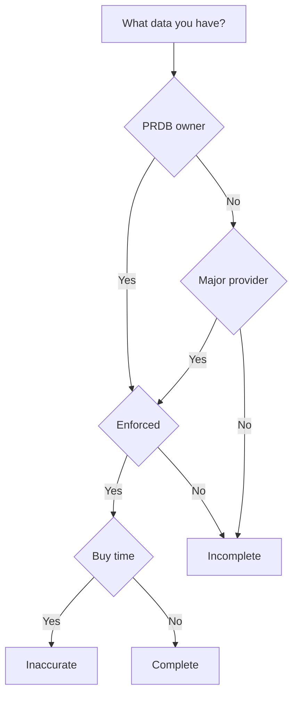

## Technology driven(ism)
As it was mentioned before, the first solution that poped up in our technology driven minds was to use Machine Learning. 

What do we know about Machine Learning?
> Machine learning is like teenage sex: everyone talks about it, nobody really knows how to do it, everyone thinks everyone else is doing it, so everyone claims they are doing it.. 
>
> (c) Someone smart and funny

What we want essentually is that our program learns how to solve a problem. There are following types of learning methods available to solve different types of problems:
- Supervised learning for predictions and classifications
- Unsupervised learning for clustering and associations
- Reinforcement learning (learn smth)

As we can see above, to be able to make predictions about parking availability we need to utilize supervised learning. 

## Supervised learning
How does the supervised learning works? In supervise learning we teach our model to make predictions in a loop:
- ask model to make a prediction based on an input data
- compare the prediction with desired output
- method adjusts model based on the error 
- repeat from the first point

The key is that we must know what should be the output for each input in the training data set. This paired data of *inputs and outputs* is named **labeled** data.

The classical example of labeled data for supervised learning is a data set of images with dogs and cats. For each image we know who is there. That is why we can train a model giving a picture of dog and decide whether we need

## ML chellanges
- Not enough data when you are not PRDB owner
- Number of free parking spots doesn't matter (every 15 min in fully occupied zone someone is leaving).

The situation might be a bit different if you are an owner of PRDB. Enforcement does a good job, so that people usually don't park without paying for it. You don't occupy a parking spot when you don't need it.

> PRDB states for Parking Rights Data Base

