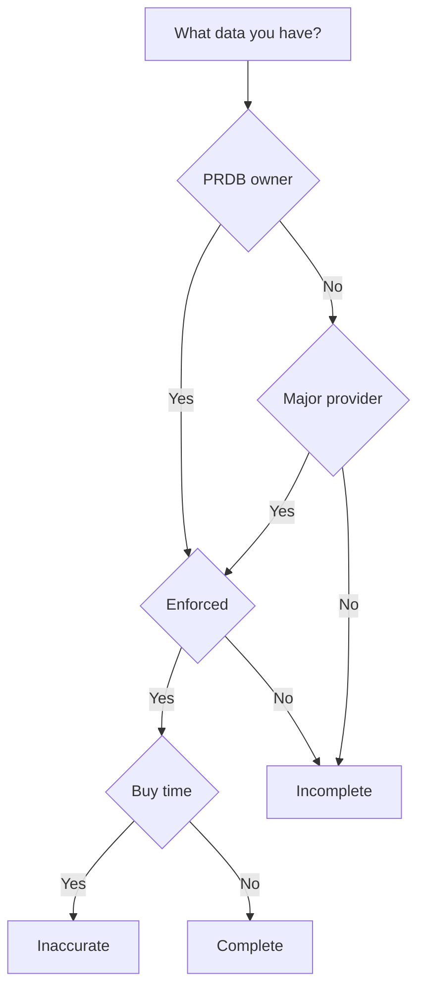

Since we are a cool and progressive company, we have hackathons! Sound fun. But what are real challanges?

> Machine learning is like teenage sex: everyone talks about it, nobody really knows how to do it, everyone thinks everyone else is doing it, so everyone claims they are doing it.. 
>
> (c) Someone smart and funny

- Everyone in a team wants to go his own direction
- Technology driven people VS goal driven
- Pitch: Speaker should speak with his own words, make it fun

## ML chellanges
- Not enough data when you are not PRDB owner
- Number of free parking spots doesn't matter (every 15 min in fully occupied zone someone is leaving).

The situation might be a bit different if you are an owner of PRDB. Enforcement does a good job, so that people usually don't park without paying for it. You don't occupy a parking spot when you don't need it.

> PRDB states for Parking Rights Data Base

